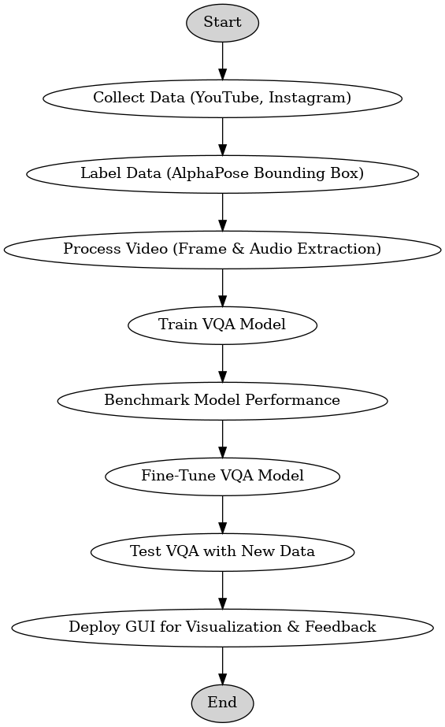

# VQA-DataGuard

### 프로세스 진행
| **분류** | **세부 내용** | **설명** |
|----------|-------------|---------|
| 데이터 수집 계획서 작성 | 학습에 필요한 데이터의 수는? | 모델의 복잡도/모델의 task에 따라 다르게 수집해야 함. |
|  | 데이터를 분류하는 기준은? | 자세 / POV / 사람의 수 / 훈련, 경기 / 미트, 샌드백 등 다양한 기준으로 분류. |
|  | 데이터 수집 | 유튜브, 인스타와 같은 온라인에서 데이터를 수집함. |
|  | 데이터 라벨링 | AlphaPose를 이용해서 bounding box를 생성. |
|  | 영상 분석 | 내가 필요한 부분만을 가져옴. |
|  |  | AI를 이용해서 계산 / 임의의 영상에 대해 문제가 없는지 테스트 진행. |
|  | 영상 분할 | 계산된 부분을 가져옴. |
|  | 데이터 저장 | 동영상은 MP4로 저장, 동영상의 이름을 JSON으로 만들어 text와 기타 데이터를 저장. |
|  | 업데이트 전략 | GitHub를 이용한 버전 관리 진행. |
| VQA 모델 학습 및 프로세스 정의 | 벤치마크 구성 | Video에서 frame과 음성 데이터를 분할함. |
|  |  | Frame의 모임과 음성의 일부를 이용해 하나의 데이터로 만듦. |
|  |  | AI를 이용해서 자동화 / 테스트 진행. |
|  | 검수 진행 | 모델의 학습이 안 되는 경우 확인 및 업데이트. |
|  |  | 벤치마크에 대한 수치적인 성능 정의. |
| VQA 모델 선택 |  | 모델의 사이즈 확인 / 벤치마크 데이터에 대한 성능 확인. |
|  |  | 모델 학습 및 하이퍼 파라미터 튜닝. |
| Sub Task |  | 학습된 VQA의 head를 바꿔 bounding box와 필요한 frame을 선택하는 모델 설계. |
|  |  | 학습된 VQA 모델을 이용해 데이터 수집 계획에 맞도록 동작하는 모델로 fine-tuning. |
| 후처리 코드 |  | Bounding box와 필요한 프레임을 분리해 저장하는 코드 개발. |
|  |  | Fine-tuning된 VQA에서 자동으로 Great Expectations으로 연결 (API). |
| 자동화 |  | 앞선 프로세스들에 대해 피드백을 통해 데이터를 추가적으로 수집. |
| 테스팅 | 테스팅 전용 코드 작성 | 데이터 수집 부분에서 각 단계별로 디버깅하기 위해 별도 테스트 코드 작성. |
|  |  | 새로운 데이터에서 VQA가 잘 동작하는지 확인. |
|  |  | Pytest를 이용한 유닛 테스트 진행. |
| 배포 | GUI | GUI를 통해 모델이 만들어낸 데이터 및 통계 정보를 쉽게 접근할 수 있도록 함. |
|  |  | 사용자 피드백을 받을 수 있도록 구성. |

### 활동 다이어그램
