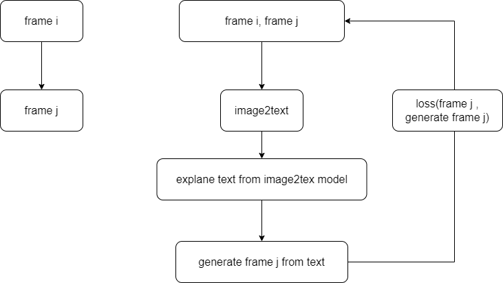

# frame2frame

실제로 비디오 데이터를 이해를 하기 위해서 첫 번째로 다음과 같이 모델링을 진행함  

사용 하는 데이터는
* joint
* mesh
* video
* multi type
로 테스트를 해볼 예정임

데이터는 frame i, frame j에 대해서 샘플링을 진행을 어떤식으로 해야할지에 대한 문제가 있음  
1. 무작위 샘플링
2. i번째 frame에 대해서 고유값의 변화량이 큰 j번째 frame을 선택

video의 경우에는 img2text, text2img 모델이 있으나 메모리 문제나 학습에 대한 문제가 있으므로 우선은 
joint나 mesh를 벡터로 이용을 해서 학습 및 테스트를 진행하고자 함  

joint의 경우에는 데이터의 양이 얼마 되지 않아서 deepseek 증류 모델을 이용해서 튜닝을 사용하 예정임  

모델 부분은 img2text와 text2img인데 이부분도
* MLP
* transformer
* diffusion process
로 테스트를 해볼 예정임
