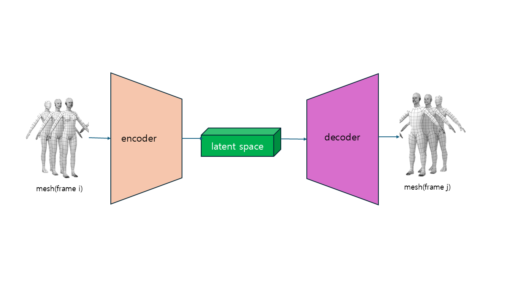
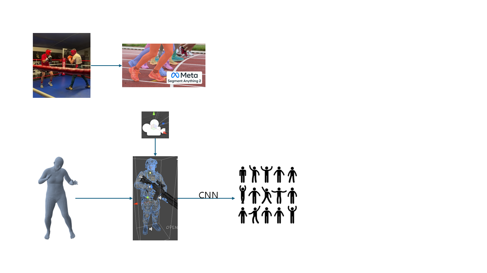

# mesh2mesh

frame2frame을 개발하기 전에 action에 대한 VAE를 개발

mesh를 이용한 버전의 VAE을 생각중임  

dataloader와 VAE 모델은 짤 수 가있으나 실제로 제일 어려운 부분은 시점임  
각 video마다 서로 다른 시점을 통일을 시켜주거나 혹은 시점에 대한 정보를 넘겨줘야 여러 video에 대해서 일괄적인 학습이 가능해짐  

하지만 video 자체는 있으나 시점에 대한 정보는 얻기가 어려움  

그래서 다음과 같이 unity를 이용함

frame과 만들어진 mesh를 unity에 올리고 카메라를 이용해서 여러 시점에 대해서 image를 만들고 만들어진 이미지와 frame들에 대해서 CNN을 통해서 데이터를 압축한 이후에 가장 유사한 시점을 찾음  